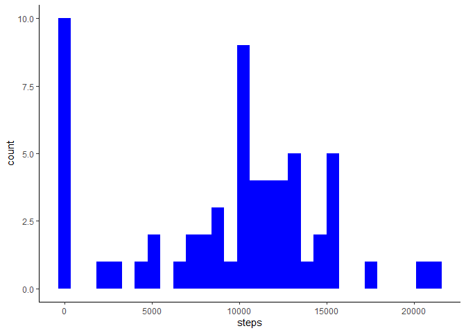
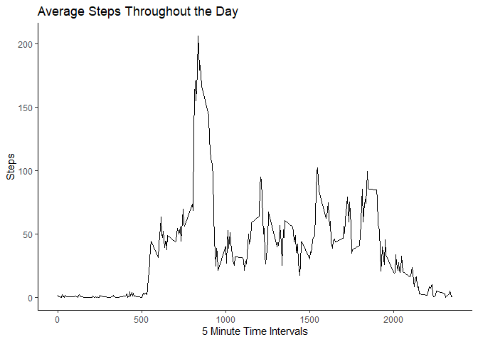
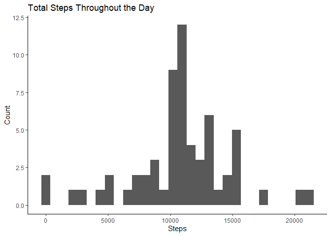
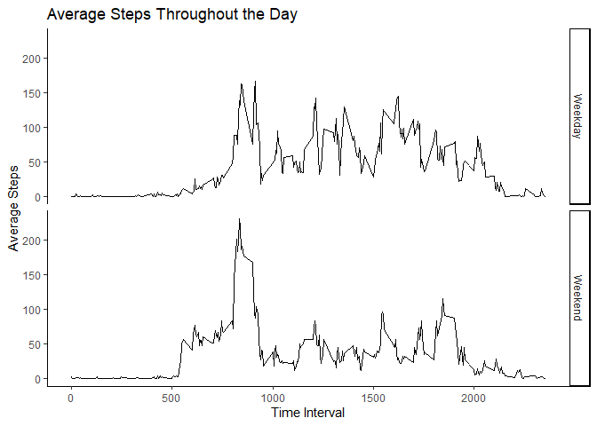

## Loading and preprocessing the data
First the data is loaded into R and transformed for the analysis. The date variable is converted to a factor


```r
Data <- read.csv("activity.csv")
Data$date <- as.factor(Data$date)
```


## What is mean total number of steps taken per day?
1. The total amount of steps taken per day is calculated.This is stored in Total
and converted to a dataframe. The variable is then named steps

2. Make a histogram. This is carried out with ggplot2, the default amount of bins
are used 


```r
Total <- tapply(Data$steps , Data$date, sum, na.rm = TRUE)
Total <- as.data.frame(Total)
names(Total) <- "steps"

library(ggplot2)
g <- ggplot(data = Total, aes(steps))
g+geom_histogram(fill = "Blue")+theme_classic()
```

<!-- -->

3. Calculate and report the mean and median. A summary is provided.


```r
summary(Total$steps)
```

```
##    Min. 1st Qu.  Median    Mean 3rd Qu.    Max. 
##       0    6778   10395    9354   12811   21194
```


## What is the average daily activity pattern?

1. Make a time series plot of 5 minute interval (x-axis) against average steps taken. First the mean of steps was calculated indexed by time interval and stored in avrg. The variable was renamed steps. The time intervals were then stored as integer values. Plot was then made using ggplot2.


```r
avrg <- as.data.frame(tapply(Data$steps, Data$interval, mean, na.rm = TRUE))
names(avrg) <- "steps"
TimeIntervals <- as.integer(row.names(avrg))
h <- ggplot(avrg, aes(TimeIntervals, steps))
h <- h+labs(title ="Average Steps Throughout the Day", x = "5 Minute Time Intervals", y = "Steps")
h+geom_line()+theme_classic()
```

<!-- -->

2. On average, which 5 minute interval contains the highest number of steps?


```r
y <- (which.max(avrg$steps))
row.names(avrg)[y]
```

```
## [1] "835"
```

## Imputing missing values

1. Calculate and report the total number of missing values


```r
sum(is.na(Data))
```

```
## [1] 2304
```
2. Devise a strategy for filling in the missing data. For this the mean per interval will be used.
3. Create a new dataset


```r
Data$steps<-ave(Data$steps,Data$interval,FUN=function(x) 
  ifelse(is.na(x), mean(x,na.rm=TRUE), x))
```

4. Make a histogram of total number of steps taken per day and calculate the mean and median. Is there a difference with the NA values imputed?


```r
sum <- as.data.frame(tapply(Data$steps, Data$date, sum, na.rm = TRUE))
names(sum) <- "steps"

i <- ggplot(sum, aes(steps))
i <- i+labs(title ="Total Steps Throughout the Day", x = "Steps", y = "Count")
i+geom_histogram()+theme_classic()
```

<!-- -->

```r
summary(sum$steps)
```

```
##    Min. 1st Qu.  Median    Mean 3rd Qu.    Max. 
##      41    9819   10766   10766   12811   21194
```

```r
summary(Total$steps)
```

```
##    Min. 1st Qu.  Median    Mean 3rd Qu.    Max. 
##       0    6778   10395    9354   12811   21194
```

As you can see, the mean of total steps per day is increased, while the median total number of steps is decreased.

## Are there differences in activity patterns between weekdays and weekends?

1. Create a new factor variable in the dataset with two levels – “weekday” and “weekend” indicating whether a given date is a weekday or weekend day.
For this, I created a function that will take the result of the weekdays() function and convert it to a character vector of either "Weekday" or "weekday". This was then added as another column to the dataset and converted to a factor


```r
library(dplyr)
Data$date <- as.character(Data$date)
Data$date <- as.Date(Data$date)
Data <- mutate(Data, day = weekdays(date))

func <- function(a){
      if(a %in% c("Monday", "Tuesday", "Wednesday", "Thursday", "Friday")){
      a <- "Weekday"
      } else{a <- "Weekend"}
      a
}

newData <- mutate(Data, isWeekday = sapply(Data$day, func))
newData$isWeekday <- as.factor(newData$isWeekday)
```

2. Make a panel plot of 5 minute interval (x axis) and average number of steps taken 


```r
newData <- as.tbl(newData)

newDatagrouped <- group_by(newData, interval)
finalData <- summarise(newDatagrouped, w = tapply(steps, isWeekday, mean))

fac <- rep(c("Weekend", "Weekday"), len = 576)

finalData <- bind_cols(finalData, fac)
names(finalData) <- c("Interval", "Steps", "isWeekday")
finalData$isWeekday <- as.factor(finalData$isWeekday)

j <- ggplot(data = finalData, aes(Interval, Steps))
j <- j+labs(title ="Average Steps Throughout the Day", x = "Time Interval", y = "Average Steps")
j <- j+facet_grid(finalData$isWeekday~.)
j+geom_line()+theme_classic()
```

<!-- -->

